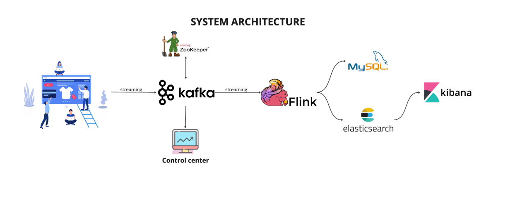

# Streaming-process E-Commerce Analytics with Flink, Elasticsearch, Kibana and MySQL

This repository contains an Apache Flink application for real-time sales analytics built using Docker Compose to orchestrate the necessary infrastructure components, including Apache Flink, Elasticsearch, Kibana, and MySQL. The application processes financial transaction data from Kafka, performs aggregations, and stores the results in both MySQL and Elasticsearch for further analysis.

## Requirements
- Docker
- Docker Compose
- Python (3.9.18)
## Architecture

## Installation and Setup
1. Clone this repository.
2. Navigate to the repository directory.
3. Run `docker-compose up -d` to start the required services (Apache Flink, Elasticsearch, MySQL, Kafka).
4. Run `python src` to start project with generate data and process data.

## Usage
1. Ensure all Docker containers are up and running.
2. The Sales Transaction Generator `generate_data.py.py` helps to generate the sales Transactions into Kafka.
3. `stream_process.py` used to ELT data from kafka to destinations.

### Application Details
The application consumes financial transaction data from Kafka, performs various transformations, and stores aggregated results in both MySQL and Elasticsearch.

### Components
#### Apache Flink
- Sets up the Flink execution environment.
- Connects to Kafka as a source for financial transaction data.
- Processes, transforms, and performs aggregations on transaction data streams.

#### MySQL
- Stores transaction data and aggregated results in tables (`Transactions`, `sales_per_category`, `sales_per_day`, `sales_per_month`).

#### Elasticsearch
- Stores transaction data for further analysis.

#### Kibana
- Visualize data through dashboard.

## Code Structure
- `stream_process.py`: Contains the Flink application logic, including Kafka source setup, stream processing, transformations, and sinks for MySQL and Elasticsearch.

## Configuration
- Kafka settings (bootstrap servers, topic) are configured within the Kafka source setup.
- MySQL connection details (URL, username, password) are defined in the `jdbcUrl`, `username`, and `password` variables.

## Sink Operations
- The application includes MySQL Python API to create tables (`Transactions`, `sales_per_category`, `sales_per_day`, `sales_per_month`) and perform insert/update operations.
- Additionally, it includes an Elasticsearch Python API to index transaction data for further analysis.
---
